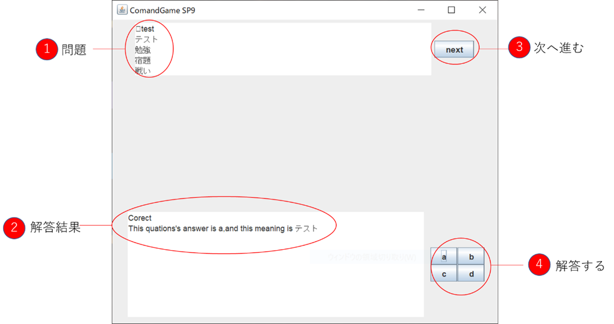
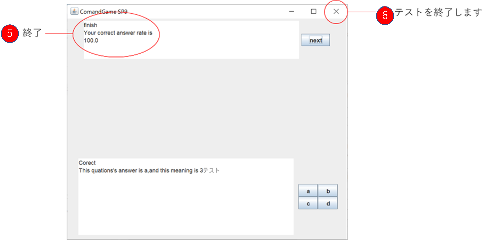

# english_test
## 目的
    本ソフトウェアでは，英単語の暗記を効率化するためクイズ方式で学習することができる英単語テストアプリの作成を目的とする．
## 実行方法
    javac ComandGame.java
    java ComandGame
## テスト方法
    本アプリケーションを起動すると，次のようなウィンドウが表示されテストを開始します．

1. 問題文が表示されます．最初の行が問題となり英単語となり，その下が選択肢で上から順にa，b，c，dと設定されています．
2. 解答すると，その結果が表示されます．“Correct”と表示されたら正解，“Discorrect”と表示されたら不正解です．また，その下の行に正しい選択肢と意味が表示されます．
3. “next”ボタンをクリックすることで次の問題に進むことができます．次の問題に進むと①の問題が次の問題のものに切り替わります．
4. 解答ボタンです．正しいと思った意味を選択します．

    すべての問題に解答すると次のように“問題“のところに表示されます．これが表示されたら，ウィンドウ右上の”דボタンをクリックしてテストを終了してください．

1. 準備されたすべての問題に解答するとこのように表示されます．最後に示された数字は今回のテストの正答率となっています．
2. “×”ボタンをクリックすることでこのアプリを完全に終了します．

## 復習のために
    本プログラムでは，間違えた問題とその答えを“missnote.txt”というファイルに記録しています．このファイルを利用することでテスト後の間違えた単語の学習を円滑に行うことができます．

